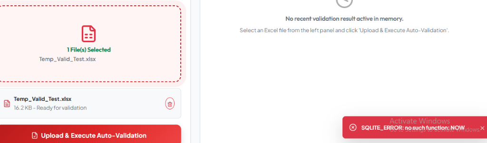
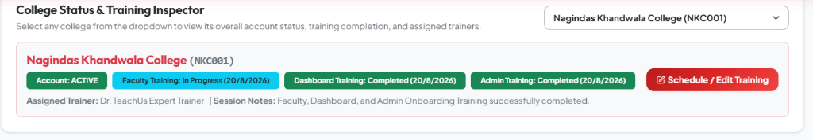

# 🎓 TeachUs - Centralized Academic Data Management & Automated Validation System

[](https://teachus-college-portal.onrender.com)
[](https://reactjs.org/)
[](https://nodejs.org/)
[](https://python.org/)
[](https://www.docker.com/)

**TeachUs** is an enterprise-grade, web-based centralized academic data collection, automated validation, and institution management platform. It replaces manual, error-prone email spreadsheet exchanges with automated row-by-row validation, instant error report generation, real-time admin monitoring, training tracker scheduling, and direct Power BI analytics integration.

---

## 🌐 Live Web Application & API Links

* 💻 **Official Web Portal**: [https://teachus-college-portal.onrender.com](https://teachus-college-portal.onrender.com)
* 👑 **Admin Portal**: [https://teachus-college-portal.onrender.com/admin](https://teachus-college-portal.onrender.com/admin)
* 🏫 **College User Workspace**: [https://teachus-college-portal.onrender.com/college](https://teachus-college-portal.onrender.com/college)
* ⚡ **Live Express Backend API**: [https://teachus-backend-api.onrender.com/api](https://teachus-backend-api.onrender.com/api)
* 📊 **Power BI Direct Data Feed**: [https://teachus-backend-api.onrender.com/api/analytics/powerbi-feed](https://teachus-backend-api.onrender.com/api/analytics/powerbi-feed)

---

## 🔑 Demo Access Credentials

| Portal Role | Username | Password | Access Scope |
| :--- | :--- | :--- | :--- |
| 👑 **System Admin** | `admin` | `admin123` | Full Executive Monitoring, Approval/Rejection, Training Scheduling, Template Publishing, Data Retention, Power BI Feed |
| 🏫 **College User** *(Nagindas Khandwala College)* | `nkc_user` | `college123` | Template Download, Data Upload, Validation Reports, Compliance Banner |
| 🏫 **College User** *(Lala Lajpat Rai College)* | `lala_user` | `college123` | College Workspace & Upload Engine |
| 🏫 **College User** *(Valia College)* | `valia_user` | `college123` | College Workspace & Upload Engine |

---

## 📸 System Screenshots & Interface Preview

### 1. Centralized Authentication Landing Portal
*Clean Crimson Red & Pure White theme with instant quick-fill demo buttons and dual role access.*


---

### 2. College Workspace & Automated Validation Engine
*Drag-and-drop file upload for Excel sheets (.xlsx, .xls) and ZIP archives with instant row-by-row validation feedback.*



---

### 3. Admin Submission Review & Remarks Modal
*Review single submission details, error lists, student rosters, and trigger instant Admin Status updates (Approve, Reject, Correction Requested, In Process).*


---

### 4. Manage Training & Onboarding Modal
*Side-by-side management and date scheduling for Faculty Training, Dashboard Training, and Admin Training.*


---

### 5. College Status & Onboarding Inspector
*Live training readiness status cards, inspector filters, and assigned trainer notes.*



---

### 6. Render 1-Click Blueprint Auto-Deployment
*Unified Docker runtime backend and static site frontend deployment configuration (`render.yaml`).*


---

## ✨ Key Features & Capability Matrix

### 🧪 1. Python 3 Automated Validation Engine
* **Row & Column Integrity**: Validates student roll numbers, names, email formats, 10-digit mobile numbers, CGPA ranges (0-10), and percentage ranges (0-100).
* **Multi-File & ZIP Archive Support**: Accepts single `.xlsx` files as well as multi-file `.zip` packages.
* **Instant Excel Error Reports**: Generates downloadable Excel sheets with highlighted error rows for quick correction by college staff.

### 🛡️ 2. Anti-Fraud & Cross-College Duplicate Alert System
* Automatically checks incoming student submissions against existing records in other colleges.
* Flags duplicate roll numbers or mobile numbers across institutions with instant visual warnings.

### 🎯 3. Onboarding & Training Scheduler (3-Pillar Training)
* Tracks three onboarding pillars side-by-side for every connected college:
  1. **Faculty Training**
  2. **Dashboard Training**
  3. **Admin Training**
* Displays assigned trainers, completion dates, and session notes across inspector cards and college banners.

### 📊 4. Power BI Direct Data Feed & Executive Analytics
* **Power BI Feed Endpoint**: Exposes a real-time JSON feed (`/api/analytics/powerbi-feed`) for direct connection into Microsoft Power BI desktop or web dashboards.
* **Executive Metrics**: Tracks total colleges, student enrollment counts, data quality scores, status ring breakdowns, and stream/branch analytics.

### 🔔 5. In-App Notification Center & Audit Trail Logging
* Real-time notifications for colleges when template versions change, submission windows open/close, or training dates update.
* Complete system audit trail logging all admin reviews, password resets, and bulk college imports.

---

## 🛠️ Technology Stack

| Layer | Technologies Used |
| :--- | :--- |
| **Frontend UI** | React 18, Vite, Bootstrap 5, Lucide Icons, Axios |
| **Backend API** | Node.js, Express.js, JWT, Bcrypt, Multer, AdmZip |
| **Validation Engine** | Python 3.11, Pandas, Openpyxl |
| **Database Architecture** | Dual-Layer: MySQL 8.0 (Production Cloud) + SQLite 3 (Zero-Config Fallback) |
| **Containerization** | Docker, Multi-Stage Dockerfile |
| **Live Hosting** | Render Blueprint (`render.yaml`), Nginx Static File Server |

---

## 🚀 1-Click Render Cloud Deployment (`render.yaml`)

This repository contains a pre-configured **Render Blueprint (`render.yaml`)**:

```yaml
services:
  - type: web
    name: teachus-backend-api
    runtime: docker
    dockerfilePath: Dockerfile.backend
    envVars:
      - key: PORT
        value: "5000"
      - key: JWT_SECRET
        value: "teachus_super_secret_jwt_key_2026"
      - key: DB_HOST
        value: "localhost"

  - type: web
    name: teachus-college-portal
    runtime: static
    rootDir: frontend
    buildCommand: npm install && npm run build
    staticPublishPath: dist
    envVars:
      - key: VITE_API_BASE_URL
        value: "https://teachus-backend-api.onrender.com/api"
```

To deploy your own live copy:
1. Fork this repository to your GitHub account.
2. Log into [Render.com](https://render.com) -> Click **New +** -> Select **Blueprint**.
3. Connect your GitHub repository and click **Deploy Blueprint**.

---

## 💻 Local Development Setup Guide

### 1. Clone Repository
```bash
git clone https://github.com/hemshah415/TeachUs-Portal.git
cd TeachUs-Portal
```

### 2. Backend Setup
```bash
cd backend
npm install
node server.js
```
*Backend API will start at `http://localhost:5000`*

### 3. Frontend Setup
```bash
cd ../frontend
npm install
npm run dev
```
*Frontend Portal will launch at `http://localhost:3000`*

---

## 📜 License & Copyright

Designed and developed for **Centralized Academic Data Management Systems**.
© 2026 TeachUs Platform. All rights reserved.
