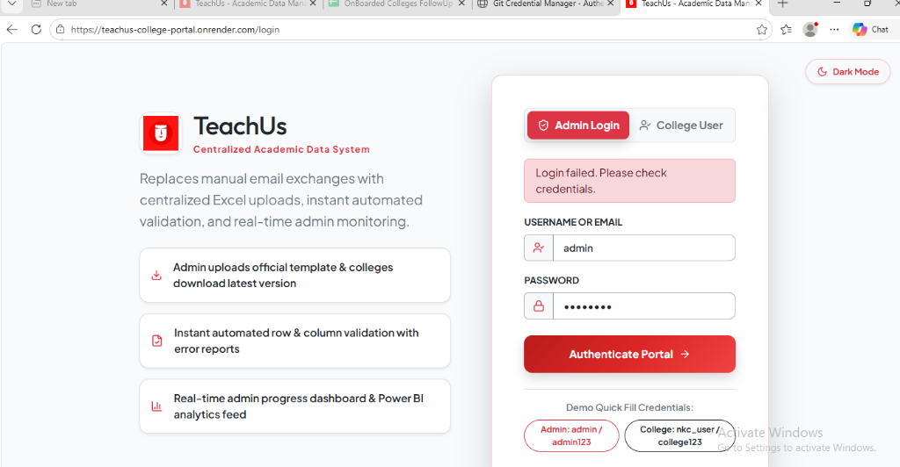
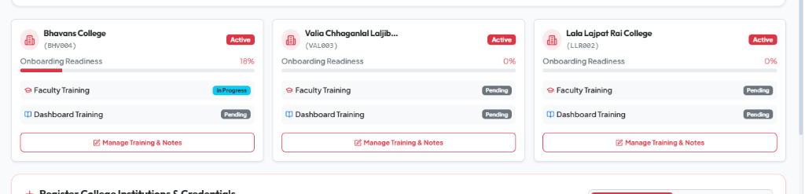
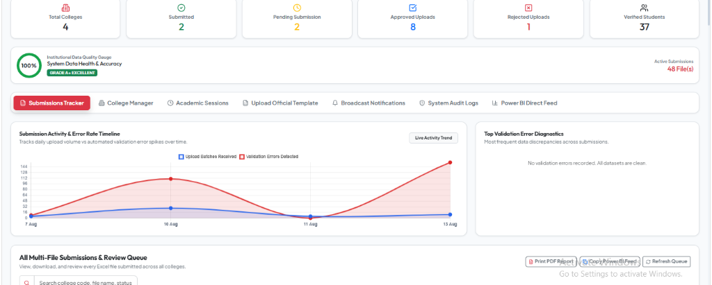
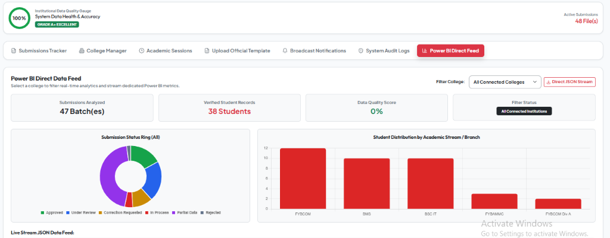
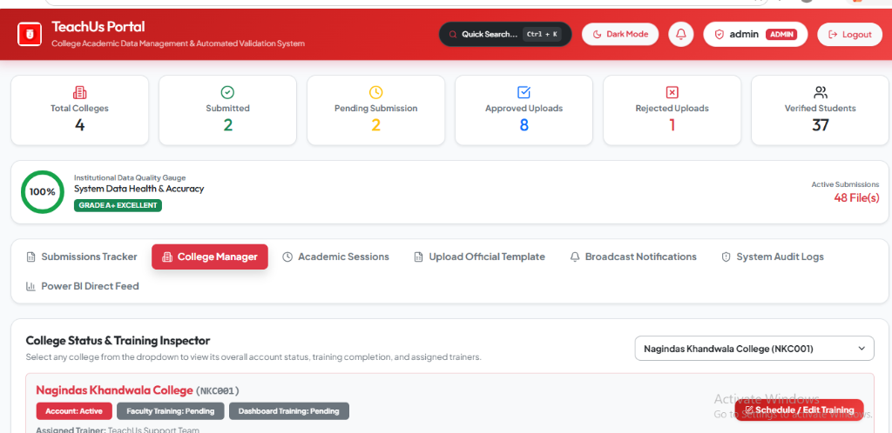
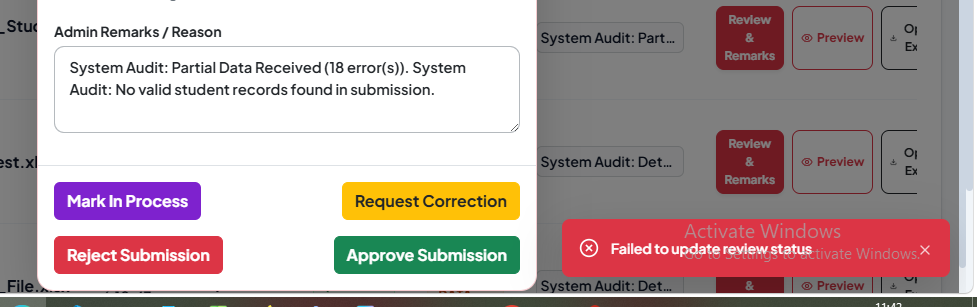
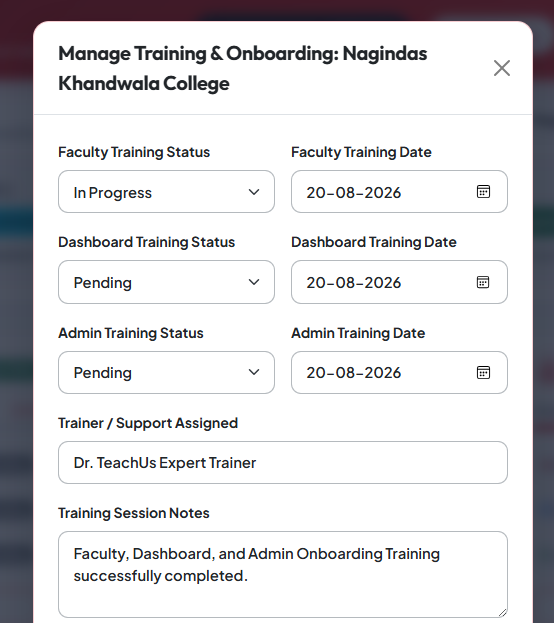
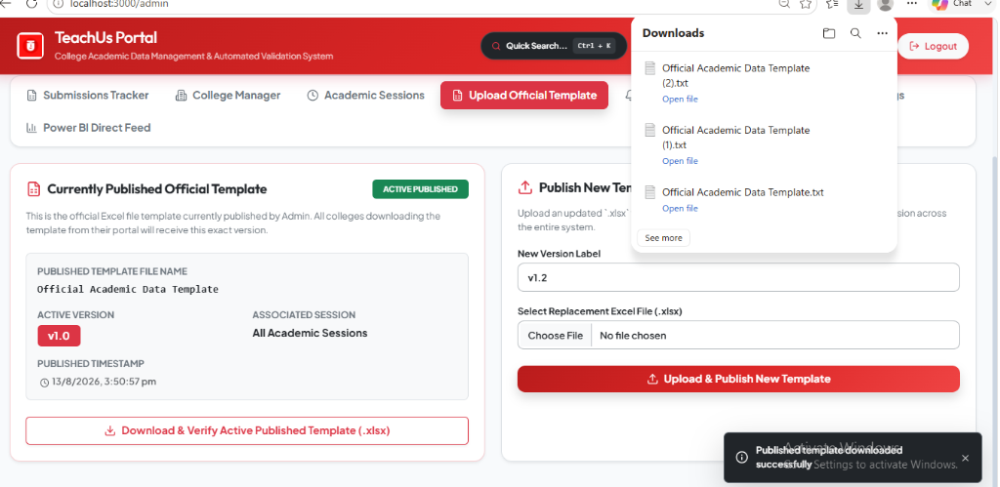
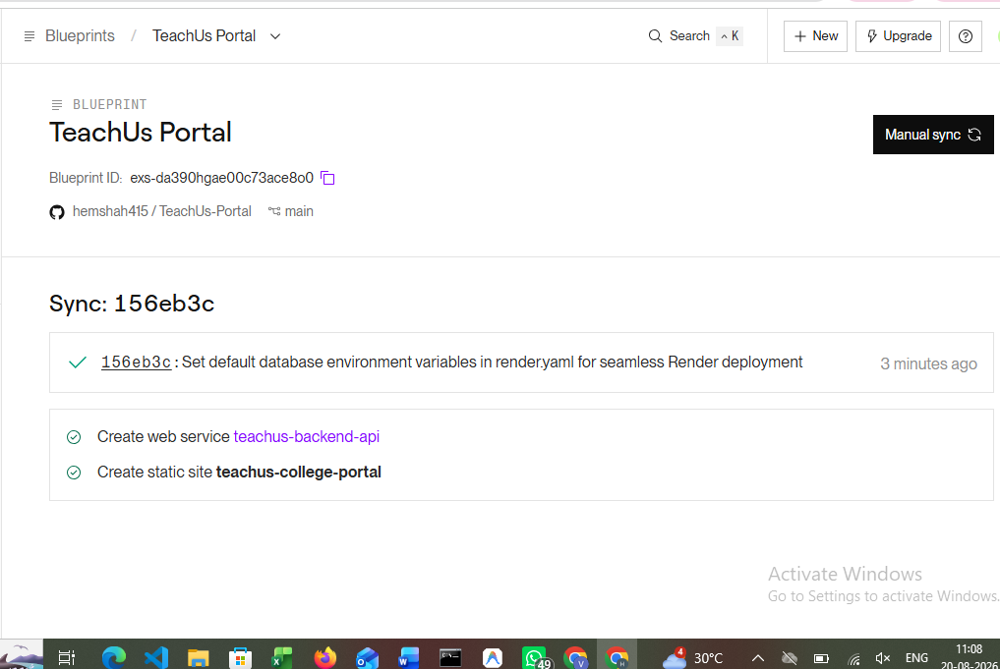

# TeachUs - Centralized Academic Data Management & Automated Validation System

TeachUs is an enterprise-grade, web-based centralized academic data collection, automated validation, and institution management platform. It replaces manual email spreadsheet exchanges with automated row-by-row validation, instant error report generation, real-time admin monitoring, training tracker scheduling, and direct Power BI analytics integration.

---

## Live Web Application & API Links

* Official Web Portal: [https://teachus-college-portal.onrender.com](https://teachus-college-portal.onrender.com)
* Admin Portal: [https://teachus-college-portal.onrender.com/admin](https://teachus-college-portal.onrender.com/admin)
* College User Workspace: [https://teachus-college-portal.onrender.com/college](https://teachus-college-portal.onrender.com/college)
* Live Express Backend API: [https://teachus-backend-api.onrender.com/api](https://teachus-backend-api.onrender.com/api)
* Power BI Direct Data Feed: [https://teachus-backend-api.onrender.com/api/analytics/powerbi-feed](https://teachus-backend-api.onrender.com/api/analytics/powerbi-feed)

---

## Demo Access Credentials

| Portal Role | Username | Password | Access Scope |
| :--- | :--- | :--- | :--- |
| System Admin | `admin` | `admin123` | Full Executive Monitoring, Approval/Rejection, Training Scheduling, Template Publishing, Data Retention, Power BI Feed |
| College User (Nagindas Khandwala College) | `nkc_user` | `college123` | Template Download, Data Upload, Validation Reports, Compliance Banner |
| College User (Lala Lajpat Rai College) | `lala_user` | `college123` | College Workspace & Upload Engine |
| College User (Valia College) | `valia_user` | `college123` | College Workspace & Upload Engine |

---

## System Interface & Feature Screenshots

### 1. Centralized Authentication Portal
Landing login interface with quick-fill credentials for Admin and College users.



---

### 2. College User Workspace & Training Compliance Banner
College user dashboard featuring academic session notifications, 3-pillar training readiness banner (Faculty, Dashboard, Admin Training), official template download card, drag-and-drop Excel file upload dropzone, and historical submission status table.



---

### 3. College Excel File Upload & Auto-Validation Execution
File selection workspace allowing college users to select Excel files (.xlsx, .xls) or ZIP archives and execute instant row-by-row automated validation with feedback.


---

### 4. Admin Dashboard Submissions Tracker & Activity Timeline
Submissions activity timeline chart tracking daily upload volume vs validation error spikes over time, alongside metric cards and multi-file review queue.



---

### 5. Power BI Direct Data Feed & Executive Analytics Charts
Real-time analytics feed showcasing submission status doughnut ring breakdown, student distribution by academic stream/branch bar chart, and direct JSON stream button.



---

### 6. Connected Colleges & Training Compliance Tracker
Connected colleges table displaying 3-pillar training completion badges (Faculty, Dashboard, Admin), contact info, and account status controls.



---

### 7. Admin Submission Review & Remarks Modal
Review single submission details, error lists, student rosters, and trigger instant Admin Status updates (Approve, Reject, Correction Requested, In Process).



---

### 8. Manage Training & Onboarding Modal
Side-by-side date picker and status scheduler for Faculty Training, Dashboard Training, and Admin Training.



---

### 9. Official Excel Template Manager
Two-card management portal allowing Admin to view currently published Excel templates and publish updated versioned templates.



---

### 10. Render 1-Click Cloud Deployment Blueprint
Unified Docker runtime backend and static site frontend deployment configuration (`render.yaml`).



---

## Key Features & Capability Matrix

### 1. College User Workspace & Self-Service Portal
* Template Version Check: Downloads the latest official versioned Excel template published by central administration.
* Multi-Format Drag & Drop Upload: Accepts single Excel files (.xlsx, .xls) and multi-file ZIP archives.
* Compliance Banner: Displays real-time onboarding readiness score and training completion status for Faculty, Dashboard, and Admin training sessions.
* Self-Service Correction: Allows colleges to view detailed validation error reports and resubmit corrected datasets.

### 2. Python 3 Automated Validation Engine
* Row & Column Integrity: Validates student roll numbers, names, email formats, 10-digit mobile numbers, CGPA ranges (0-10), and percentage ranges (0-100).
* Multi-File & ZIP Archive Support: Accepts single `.xlsx` files as well as multi-file `.zip` packages.
* Instant Excel Error Reports: Generates downloadable Excel sheets with highlighted error rows for quick correction by college staff.

### 3. Anti-Fraud & Cross-College Duplicate Alert System
* Automatically checks incoming student submissions against existing records in other colleges.
* Flags duplicate roll numbers or mobile numbers across institutions with instant visual warnings.

### 4. Onboarding & Training Scheduler (3-Pillar Training)
* Tracks three onboarding pillars side-by-side for every connected college:
  1. Faculty Training
  2. Dashboard Training
  3. Admin Training
* Displays assigned trainers, completion dates, and session notes across inspector cards and college banners.

### 5. Power BI Direct Data Feed & Executive Analytics
* Power BI Feed Endpoint: Exposes a real-time JSON feed (`/api/analytics/powerbi-feed`) for direct connection into Microsoft Power BI desktop or web dashboards.
* Executive Metrics: Tracks total colleges, student enrollment counts, data quality scores, status ring breakdowns, and stream/branch analytics.

### 6. In-App Notification Center & Audit Trail Logging
* Real-time notifications for colleges when template versions change, submission windows open/close, or training dates update.
* Complete system audit trail logging all admin reviews, password resets, and bulk college imports.

---

## Technology Stack

| Layer | Technologies Used |
| :--- | :--- |
| Frontend UI | React 18, Vite, Bootstrap 5, Lucide Icons, Axios |
| Backend API | Node.js, Express.js, JWT, Bcrypt, Multer, AdmZip |
| Validation Engine | Python 3.11, Pandas, Openpyxl |
| Database Architecture | Dual-Layer: MySQL 8.0 (Production Cloud) + SQLite 3 (Zero-Config Fallback) |
| Containerization | Docker, Multi-Stage Dockerfile |
| Live Hosting | Render Blueprint (`render.yaml`), Nginx Static File Server |

---

## 1-Click Render Cloud Deployment (`render.yaml`)

This repository contains a pre-configured Render Blueprint (`render.yaml`):

```yaml
services:
  - type: web
    name: teachus-backend-api
    runtime: docker
    dockerfilePath: Dockerfile.backend
    envVars:
      - key: PORT
        value: "5000"
      - key: JWT_SECRET
        value: "teachus_super_secret_jwt_key_2026"
      - key: DB_HOST
        value: "localhost"

  - type: web
    name: teachus-college-portal
    runtime: static
    rootDir: frontend
    buildCommand: npm install && npm run build
    staticPublishPath: dist
    envVars:
      - key: VITE_API_BASE_URL
        value: "https://teachus-backend-api.onrender.com/api"
```

To deploy your own live copy:
1. Fork this repository to your GitHub account.
2. Log into Render.com -> Click New + -> Select Blueprint.
3. Connect your GitHub repository and click Deploy Blueprint.

---

## Local Development Setup Guide

### 1. Clone Repository
```bash
git clone https://github.com/hemshah415/TeachUs-Portal.git
cd TeachUs-Portal
```

### 2. Backend Setup
```bash
cd backend
npm install
node server.js
```
Backend API will start at `http://localhost:5000`

### 3. Frontend Setup
```bash
cd ../frontend
npm install
npm run dev
```
Frontend Portal will launch at `http://localhost:3000`

---

## License & Copyright

Designed and developed for Centralized Academic Data Management Systems.
Copyright 2026 TeachUs Platform. All rights reserved.
